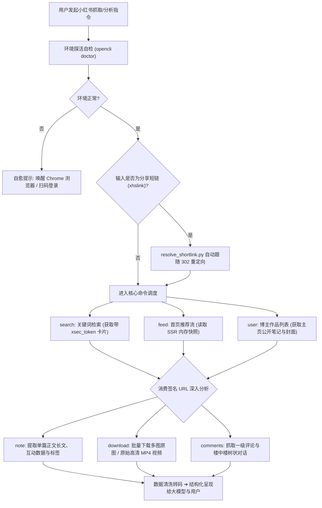

# skill-xiaohongshu-opencli-fetcher

基于 **OpenCLI** 与桌面 Chrome 真实浏览器扩展桥接的小红书（XiaoHongShu）全能数据采集与分析技能。  
彻底告别传统爬虫频繁失效与抓包提取 Cookie 的繁琐操作，实现 **“免维护 Cookie、零风控风险、真实指纹、全能力覆盖”** 的小红书数据获取体验。

---

## GitHub 仓库信息

- **项目开源地址**：[https://github.com/JasonCai2024/skill-xiaohongshu-opencli-fetcher](https://github.com/JasonCai2024/skill-xiaohongshu-opencli-fetcher)
- **Git Clone 链接**：`git clone https://github.com/JasonCai2024/skill-xiaohongshu-opencli-fetcher.git`

---

## 业务流程图



---

## 文件目录结构

```text
skill-xiaohongshu-opencli-fetcher/
├─ SKILL.md                              # 技能主工作说明书 (指令、约束与决策流)
├─ README.md                             # 本说明文件 (项目介绍、安装指引、决策表)
├─ .env.example                          # 凭据隔离规范示例
├─ .gitignore                            # 忽略本地临时文件与媒体产物
├─ scripts/
│  ├─ resolve_shortlink.py               # 移动端 302 分享短链自动解析中间件
│  └─ xhs_fetcher.py                     # 全功能 Python 封装与调度工具
└─ references/
   ├─ opencli-setup-guide.md             # 3 步环境安装与配置 SOP
   ├─ commands-reference.md              # 6 大命令参数与实测数据结构手册
   └─ troubleshooting.md                 # 常见错误自愈排查指南
```

---

## 获取与安装配置说明（只需一次，终身免维护）

### 1. 前置依赖安装
确保系统已安装 Node.js（v18+），在终端执行：
```bash
npm install -g @jackwener/opencli
```

### 2. 安装 Chrome 浏览器扩展
- **途径 A（Chrome 网上应用店）**：直接在 Chrome Web Store 搜索 `OpenCLI` 安装并启用；
- **途径 B（本地解压加载）**：
  1. 运行 `opencli extension install`；
  2. 在 Chrome 打开 `chrome://extensions/` 开启开发者模式，点击“加载已解压的扩展程序”，选中 `~/.opencli/extension`。

### 3. 小红书账号登录与探活
1. 在已启用扩展的 Chrome 中打开 `https://www.xiaohongshu.com` 正常登录账号；
2. 终端执行探活命令：
   ```bash
   opencli doctor
   ```
   看到 `[OK] Connectivity: connected` 即表示全链路就绪！

---

## 凭证安全与隔离规范

本技能基于纯本地真实桌面浏览器扩展通信机制：
- **零凭证存储**：不记录、不保存、不上传任何 Cookie、Token、账号或密码；
- **环境隔离**：`.env.example` 为规范占位，`.gitignore` 严格忽略所有临时日志、媒体下载产物与本地凭证变体；
- **绝对安全**：一切请求完全继承您本机日常使用的真实浏览器指纹与安全会话。

---

## 核心设计决策对照表

| 决策维度 | 本技能方案 | 传统爬虫 / MCP 方案 | 核心优势 |
|---|---|---|---|
| **登录态维护** | **完全继承真实 Chrome** | 需抓包手动复制 Cookie | **终身免维护**，无需手动更新 Cookie |
| **风控对抗** | **原生真实浏览器指纹** | 无头浏览器 / 模拟 HTTP 请求 | 极难被小红书安全网关识别拦截 |
| **短链支持** | **内置 302 自动重定向解析** | 仅支持长链，短链必报错 | 用户随手粘贴手机分享文案即可直接识别 |
| **媒体提取** | **直接穿透嗅探原始 MP4/多图** | 页面加密流难以提取 | 批量下载无水印多图原图与 1080P MP4 视频 |
| **评论结构** | **树状还原楼中楼 (reply_to)** | 扁平乱序输出 | 完美还原评论区多人互动对话层级与 IP 属地 |
