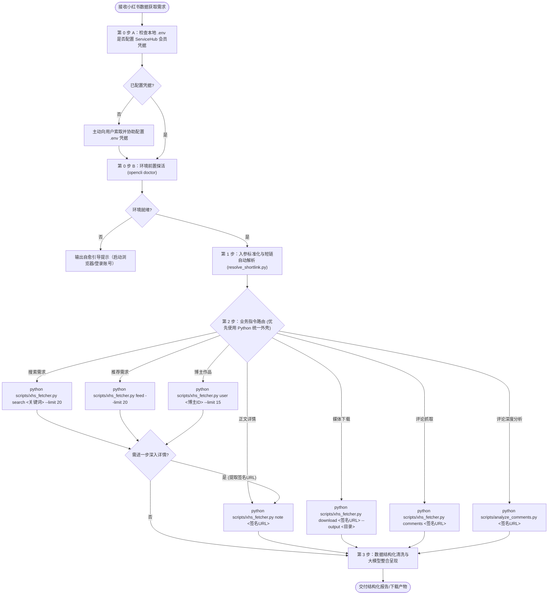

# 小红书 OpenCLI 数据获取助手（Skill: skill-xiaohongshu-opencli-fetcher）

## Goal
指导 AI 助理通过本地 OpenCLI 守护进程与 Chrome 真实浏览器扩展，实现小红书平台全维度数据（搜索、推荐、博主、正文、多图/视频媒体、楼中楼评论、高价值全景分析）的自动化采集、短链解析与清洗分析，做到免维护 Cookie、零风控封禁风险。

---

## Required Inputs
根据用户业务需求，接收以下至少一种输入：
1. **搜索关键词（Search Query）**：如 `"DeepSeek 实操"`、`"AI 智能体落地"`（支持可选 `--limit`，默认 20 条）；
2. **小红书笔记 URL / 移动端短链（Note URL / Shortlink）**：如 `https://www.xiaohongshu.com/explore/xxx?xsec_token=yyy` 或 `https://xhslink.cn/a/xxx`；
3. **博主 ID / 主页短链（User ID / Profile Shortlink）**：如 `5f310fd50000000001009df5` 或 `https://xhslink.cn/m/xxx`（支持可选 `--limit`，默认 15 条）；
4. **推荐流抓取指令（Feed Instruction）**：如“获取首页推荐最新笔记”（支持可选 `--limit`，默认 20 条）；
5. **媒体下载路径（Download Output Dir）**：如 `--output "./xhs_media"`；
6. **评论抓取修饰符（Comments Modifier）**：如 `--with-replies`（开启楼中楼子回复）；
7. **ServiceHub 会员凭据（可选/前置）**：`SERVICEHUB_USERNAME` 与 `SERVICEHUB_PASSWORD`（未配置时 AI 助理需主动向用户索取并协助写入 `.env`）。

---

## Workflow

### 步骤 0：ServiceHub 会员凭据与环境前置检查（Preflight & Auth Check）
1. **会员凭据检查**：
   - 检查当前环境或项目根目录的 `.env` 中是否已配置 `SERVICEHUB_USERNAME` 与 `SERVICEHUB_PASSWORD`；
   - **若尚未配置**：AI 助理应当主动提示用户：
     > 💬 *“您好！本小红书全能技能核心底层为 ServiceHub 会员专属工具。检测到当前尚未配置会员凭证，请提供您的 ServiceHub 用户名与密码/Token，我来帮您写入 `.env` 文件（或请您在 `.env` 中手动配置）；开通或获取会员账号请访问 ServiceHub 平台。”*
2. **环境探活检查**：
   - 执行 `opencli doctor`：
   - 若返回 `Connectivity: connected`，环境正常，继续执行；
   - 若提示连接失败或未登录，按 [Troubleshooting](references/troubleshooting.md) 规则友好引导用户。

### 步骤 1：入参标准化与短链自动解析
如果用户输入的是移动端分享短链（`xhslink.cn` 或 `xhslink.com`）：
- 调用内置脚本 `python scripts/resolve_shortlink.py "<短链>"`；
- 自动跟随 302 重定向提取出 24 位博主 ID 或包含 `xsec_token` 的完整 Web 长链。

### 步骤 2：核心命令调度执行（统一 Python 外壳调度）
根据用户需求精准调用技能内置脚本（底层全自动完成会员验签、Node.js 警告压制与 Windows 路径自适应）：

| 业务需求 | 🌟 推荐标准调用命令（Python 统一外壳） | 底层等效命令（OpenCLI 原生） |
|---|---|---|
| **关键词搜索** | `python scripts/xhs_fetcher.py search "<query>" --limit 20` | `opencli xiaohongshu search "<query>" --limit 20 -f yaml` |
| **首页推荐流** | `python scripts/xhs_fetcher.py feed --limit 20` | `opencli xiaohongshu feed --limit 20 -f yaml` |
| **博主主页作品** | `python scripts/xhs_fetcher.py user "<user_id>" --limit 15` | `opencli xiaohongshu user <user_id> --limit 15 -f yaml` |
| **单篇笔记正文** | `python scripts/xhs_fetcher.py note "<signed_url>"` | `opencli xiaohongshu note "<signed_url>" -f yaml` |
| **多图/视频下载** | `python scripts/xhs_fetcher.py download "<signed_url>" --output "<dir>"` | `opencli xiaohongshu download "<signed_url>" --output "<dir>" -f yaml` |
| **快速评论抽样（约75条）** | `python scripts/xhs_fetcher.py comments "<signed_url>"` | `opencli xiaohongshu comments "<signed_url>" --with-replies -f yaml` |
| **全量深度评论抓取（140~150条）** | `python scripts/full_comments_fetcher.py "<signed_url>" --limit 500 -o output.json` | - |
| **🧠 爆款高价值评论全景分析** | `python scripts/analyze_comments.py "<signed_url>" --title "<笔记标题>"` | - |

*(注：建议 AI 助理优先调用 `python scripts/xhs_fetcher.py` 系列命令，可自动处理跨平台路径与输出格式化)*

### 步骤 3：数据清洗与综合交付
- 将抓取的 YAML/JSON 数据整合为结构化摘要；
- 若用户需要下载媒体，汇报本地存储路径与文件清单；
- 若用户提示【请对笔记的评论进行分析】或表达类似意思，**自动严格执行《高价值评论分析框架》**，生成标准 3 板块全景洞察报告。

---

## Decision Rules

1. **xsec_token 依赖流原则（核心）**：
   - 严禁凭空手写或伪造笔记详情 URL；
   - 必须先通过 `search`、`feed` 或 `user` 获取带有官方 `xsec_token` 签名的 URL，再传递给 `note`、`download` 或 `comments` 执行后续消费；
   - 遵循“即查即读”原则，不在数据库中持久化缓存签名 URL 超过 24 小时。
2. **短链自动展开原则**：
   - 遇到任何 `xhslink` 前缀的短链接，必须先经 `resolve_shortlink.py` 解析为标准长链或 ID，严禁直接把短链当成 User ID 传给 `user` 命令。
3. **媒体下载按需分流**：
   - 图文笔记：`download` 自动提取全部轮播多图无水印高清原图（`1.jpg`, `2.jpg`...）；
   - 视频笔记：`download` 自动穿透嗅探原始高清 `.mp4` 视频流文件与封面大图。
4. **评论抓取按需分级策略与 Web 端物理边界**：
   - **快速抽样模式**：调用 `opencli xiaohongshu comments`（自动切换移动端域名），秒级提取前排高赞与核心楼中楼约 75 条样本；
   - **全量深度抓取模式**：当需要做深度舆情分析时，调用 `python scripts/full_comments_fetcher.py "<url>"`，通过平滑触底与楼中楼多轮递归展开，穷尽抓取 Web 端极限 **140~150 条高质量样本（覆盖率约 38%，囊括 100% 核心热评）**；
   - **报告口径规范**：评论分析报告中明确注明：`官方元数据总数 N 条，Web 端已穷尽提取核心高赞及楼中楼样本 140+ 条（覆盖率约 38%），其余 62% 长尾评论受小红书产品导流策略限制仅在手机 App 端分页呈现`。
5. **🧠 评论分析触发准则（当用户提示“分析评论/拆解评论区”时强制触发）**：
   - **执行标准**：严格执行 [comment-analysis-framework.md](references/comment-analysis-framework.md) 标准；
   - **降噪排杂**：自动剔除纯表情、单字打卡等无实质水评；
   - **四维归类**：商业引流/截流、实质情绪/争议、增量情报/内幕、真实需求/询问；
   - **100% 全量原声展现**：高价值评论必须 **100% 全部输出，绝不人工节选截断**（保留所有内推码、网址、内幕与真实诉求）；
   - **标准交付结构**：严格按照【1. 评论生态与样本说明】、【2. 四大高价值评论全量原声清单】、【3. 高价值人群画像靶向切片】三大板块客观交付。
6. **🔒 ServiceHub 会员授权门禁准则**：
   - 本技能核心调度引擎（`_xhs_core`）已完成二进制加密，专属于 ServiceHub 注册会员使用；
   - 首次使用需在本地根目录 `.env` 中配置 `SERVICEHUB_USERNAME` 与 `SERVICEHUB_PASSWORD`；
   - 未授权或非会员调用时，底层将安全阻断并提示用户前往 ServiceHub 平台激活会员。

---

## Output Requirements

根据调用的子命令，严格输出如下规范化结构：

1. **搜索结果列表（Search Output）**：
   每项包含 `rank`（序号）、`title`（标题）、`author`（博主）、`author_url`（带签名博主主页）、`likes`（点赞）、`published_at`（发布时间）、`url`（带 `xsec_token` 签名直链）。
2. **推荐流列表（Feed Output）**：
   每项包含 `id`、`title`、`type`（`normal` 图文 / `video` 视频）、`author`、`likes`、`url`（带签名直链）。
3. **博主作品列表（User Output）**：
   每项包含 `id`、`title`、`type`、`likes`、`cover`（封面原图 CDN）、`url`（带签名直链）。
4. **单篇笔记正文详情（Note Output）**：
   包含 `title`（标题）、`author`（作者）、`content`（**完整长文正文与文案**）、`likes`/`collects`/`comments`（互动数据）、`tags`（所有 `#话题标签`）。
5. **媒体下载产物（Download Output）**：
   清晰列出下载文件的本地绝对路径、文件类型（图文轮播 `1.jpg` / 视频 `1.mp4`）与体积大小。
6. **评论树对话树（Comments Output）**：
   包含 `author`、`userId`、`text`、`likes`、`time`（含 IP 属地）、`is_reply`（是否为子回复）、`reply_to`（**被回复人昵称**）、`images`（评论晒图）。
7. **高价值评论全景深度洞察报告（Comment Analysis Output）**：
   严格输出包含【1. 评论生态与样本说明】、【2. 四大高价值评论全量原声清单 (100% 完整罗列)】、【3. 高价值人群画像靶向切片】的三大标准板块。

---

## Validation
- [ ] `opencli doctor` 探活通过，Daemon 与 Extension 双绿灯；
- [ ] 搜索/推荐返回的笔记 URL 中完整包含 `?xsec_token=...`；
- [ ] 提取的正文无缺失、评论区层级正确；
- [ ] 媒体下载文件大小正常（非 0 字节）。

---

## Fallback
- **若提示未配置 ServiceHub 凭证（`SERVICEHUB_AUTH_REQUIRED`）**：
  AI 助理应当主动输出提示：*“当前技能需要 ServiceHub 会员凭据才能启动核心调度引擎。请提供您的 ServiceHub 用户名与密码，我将帮您写入 `.env` 文件；或请在项目根目录 `.env` 中添加 `SERVICEHUB_USERNAME` 和 `SERVICEHUB_PASSWORD`。”*
- **若提示会员鉴权失败（`SERVICEHUB_AUTH_FAILED`）**：
  提示用户账号密码可能输入有误或会员已过期，协助检查 `.env` 中的凭据是否正确。
- **若触发登录墙（`AUTH_REQUIRED`）**：提示用户在已开启扩展的 Chrome 浏览器中打开 `xiaohongshu.com` 扫码登录并刷新；
- **若扩展断连（`EXTENSION_DISCONNECTED`）**：提示用户确保 Chrome 浏览器已打开且 OpenCLI 插件处于开启状态；
- **若笔记不存在或风控拦截（`EMPTY_RESULT` / `SECURITY_BLOCK`）**：提示该笔记可能已被博主删除或设置为仅自己可见。

---

## Examples

### 示例 1：热点搜索与前排正文分析
- **用户 Prompt**：“帮我搜一下小红书上关于 DeepSeek 的最新热门笔记，并把点赞最高的一篇正文读出来。”
- **助理行为**：
  1. 执行 `python scripts/xhs_fetcher.py search "DeepSeek" --limit 20` 获得 20 篇带签名笔记；
  2. 选取 rank 1 的笔记 URL；
  3. 执行 `python scripts/xhs_fetcher.py note "<rank1_url>"` 抓取正文；
  4. 提炼核心观点并交付结构化总结。

### 示例 2：手机短链博主深度调研
- **用户 Prompt**：“我想看这个博主的所有作品：`https://xhslink.cn/m/uWP0uFkbut`”
- **助理行为**：
  1. 调用 `python scripts/resolve_shortlink.py "https://xhslink.cn/m/uWP0uFkbut"` 解析短链得到博主 ID `69c28b290000000033005c9c`；
  2. 执行 `python scripts/xhs_fetcher.py user 69c28b290000000033005c9c --limit 15` 获取 15 篇作品列表；
  3. 为用户分类梳理该博主的选题方向与爆款数据。

### 示例 3：爆款评论区 100% 全景洞察
- **用户 Prompt**：“请对这篇笔记的评论区进行深度分析：`https://www.xiaohongshu.com/explore/...`”
- **助理行为**：
  1. 执行 `python scripts/analyze_comments.py "https://www.xiaohongshu.com/explore/..." --title "..."`；
  2. 自动完成全量楼中楼展开与智能降噪；
  3. 输出 3 板块全景洞察报告。
