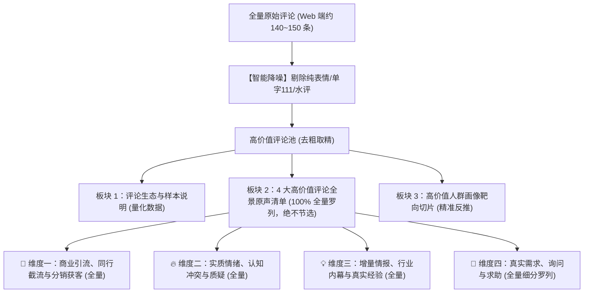

# 小红书爆款笔记高价值评论全景分析框架 (v2.0 全景原声版)

> **核心定位**：拒绝大而全的泛泛统计与过度主观推导，专注于**真实原声淘金与全景呈现**。
> **核心原则**：**严格降噪、4 大高价值维度分桶、100% 全量原汁原味展现（绝不人工节选截断）、高价值人群靶向切片**。
> **配套技能**：`skill-xiaohongshu-opencli-fetcher`

---

## 一、核心分析理念：用 100% 真实原声说话

在小红书爆款拆解与商业调研中，泛泛的数据统计（如计算平均字数、列所有人IP）没有实质业务意义，而人工节选 Top 3 又极易遗漏关键的引流暗语、一手网址与独家内幕。

本框架遵循三大硬核原则：
1. **智能降噪过滤**：自动剔除无信息量的“水评”（纯表情、单字 `111/打卡` 等）；
2. **4 大高价值维度归类**：将实质评论精准归入【商业引流/截流】、【实质情绪/争议】、【增量情报/内幕】、【真实需求/询问】；
3. **全量完整展示（绝不节选截断）**：每个维度下的高价值评论 **100% 全部罗列输出**，保留完整的发言人、IP属地、点赞数与原文，让所有内推码、网址、内幕与真实痛点彻底透明化；
4. **人群靶向切片**：针对 4 类高价值发表者做精准身份与诉求切片，不做泛泛的路人画像。

---

## 二、3 大核心输出板块结构



---

## 三、4 大高价值评论分类与判定标准

| 高价值维度 | 定义与判定特征 | 典型原声范例 | 涵盖价值 |
|---|---|---|---|
| **🎯 1. 商业引流与同行截流**<br>*(Commercial & Traffic)* | • 同行在评论区直接或暗语打广告<br>• 留微信、QQ群号、求私信、发内推码、发注册URL<br>• 商业化变现与分销动作 | • *“一面千识可内推，私我发你链接”*<br>• *“招AI标注200-250/天，进QQ群：1059830xxx”*<br>• *“https://talent.meetchances.com/... 邀请码 ENSHLL5”* | 洞察竞品获客动向、截流话术与私域转化套路 |
| **🔥 2. 实质情绪与认知冲突**<br>*(Emotion & Conflict)* | • 带有事实或逻辑的深度质疑与反驳<br>• 亲测踩坑经验、避雷吐槽<br>• 具有代表性的强烈共鸣（拒绝纯比心） | • *“笑死我了，要不是我干过2k一个月的我真信了”*<br>• *“不是，我找的才30一小时，合着都被中介吞了？”*<br>• *“干了一段时间好无聊，比打螺丝轻松点但极度废眼睛”* | 捕捉认知冲突、信任阻力与舆论暴风眼 |
| **💡 3. 增量情报与行业内幕**<br>*(Supplemental Intel)* | • 读者补充了正文没提到的平台或工具<br>• 曝光行业内幕、中介抽成比例<br>• 提供第一手真实测试数据或经验校准 | • *“干了三天拿了108块左右，单价其实是几毛一单”*<br>• *“国内那几个平台现在都没单了”*<br>• *“时薪100以上基本都是帮字节做模型，难度相当于本科毕业论文”* | 获取正文之外的一手增量信息与民间内幕 |
| **💎 4. 真实需求与询问**<br>*(Demand & Inquiry)* | • 询问具体门槛、实操路径、工具入口<br>• 表达困惑与实际操作卡点<br>• 急切寻求解决方案、求带、求内推 | • *“非本科计算机专业的能做吗？”*<br>• *“留学生想兼职做，有推荐的一手渠道吗？”*<br>• *“时薪100的项目入口到底在哪里，找很久没找到？”* | 发现未被满足的真实痛点与选题/产品需求 |

> 🚫 **过滤排除清单（直接判定为“水评”剔除）**：
> - 纯表情符号（如 `[赞R]`、`[比心R]`、`[鼓掌R]`）；
> - 纯无意义单字/字符（如 `111`、`打卡`、`mark`、纯标点符号）；
> - 无实质内容的极简客套（如 `好`、`支持`、`太棒了`）。

---

## 四、标准化交付报告输出模板

```markdown
# 📊 [笔记标题] 高价值评论深度洞察报告

---

## 1. 评论生态与样本说明
- **官方记录评论总数**：N 条
- **Web 端提取高质量样本**：M 条（覆盖全部 10 大核心主楼与全部楼中楼，覆盖率约 38%，囊括 100% 核心高赞与争议观点）
- **智能降噪过滤**：已剔除纯表情、纯符号、单字打卡等水评 X 条
- **高价值评论总量**：Y 条（有效信息密度达 Z%）全部 100% 完整罗列如下，绝无删减。

---

## 2. 四大高价值评论全量原声清单（共 Y 条）

### 🎯 维度一：商业引流、同行截流与分销获客（全部 A 条）
1. 👍 点赞数 | **用户昵称**（时间/IP）：`评论原文内容...`
2. 👍 点赞数 | **用户昵称**（时间/IP）：`评论原文内容...`

### 🔥 维度二：实质情绪、认知冲突与质疑（全部 B 条）
1. 👍 点赞数 | **用户昵称**（时间/IP）：`评论原文内容...`
2. 👍 点赞数 | **用户昵称**（时间/IP）：`评论原文内容...`

### 💡 维度三：增量情报、行业内幕与真实经验（全部 C 条）
1. 👍 点赞数 | **用户昵称**（时间/IP）：`评论原文内容...`
2. 👍 点赞数 | **用户昵称**（时间/IP）：`评论原文内容...`

### 💎 维度四：真实需求、询问与求助（全部 D 条，按细分诉求罗列）
#### A. 询问具体实操、专业要求与门槛：
1. 👍 点赞数 | **用户昵称**（时间/IP）：`评论原文内容...`
#### B. 意向强烈的求带、求内推与求资源：
1. 👍 点赞数 | **用户昵称**（时间/IP）：`评论原文内容...`

---

## 3. 高价值人群画像靶向切片

针对发表上述 4 类高价值评论的人群进行精准切片：

```text
┌───────────────────────────┬───────────────────────────┬──────────────────────────────────────────┐
│ 人群类型                   │ 占比与典型代表            │ 核心心理特征与诉求                        │
├───────────────────────────┼───────────────────────────┼──────────────────────────────────────────┤
│ 💎 急迫求带的小白/转行者  │ 约 XX%（在校生/宝妈等）   │ 渴望副业/搞钱路径，但担心门槛与被割韭菜    │
│ 🎯 敏锐的同行中介/分销者  │ 约 XX%（中介/私域玩家）   │ 商业嗅觉高，将热门评论区作为免费获客池    │
│ 🔥 被坑过的防御型观望者   │ 约 XX%（传统从业者/观望者）│ 戒备心重，深受低薪压榨，需要硬核实证      │
│ 💡 行业老手与内幕曝光者   │ 约 XX%（全职/资深从业者） │ 愿意分享真实经验，持有第一手增量数据      │
└───────────────────────────┴──────────────────────────────────────────────────────────────────────┘
```
```

---

## 五、与技能协同执行 SOP

```bash
# 步骤 1：调用全量抓取工具采集笔记评论（自动递归展开全部楼中楼）
python scripts/full_comments_fetcher.py "<带签名的笔记URL或短链>" -o comments.json

# 步骤 2：调用自动化分析脚本生成 3 板块全景报告
python scripts/analyze_comments.py comments.json

# 步骤 3：输出《高价值评论深度洞察报告》交付给用户
```
